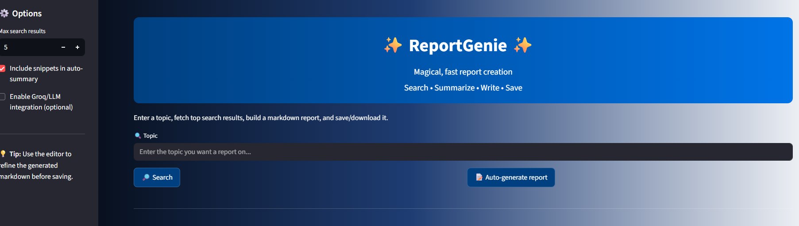
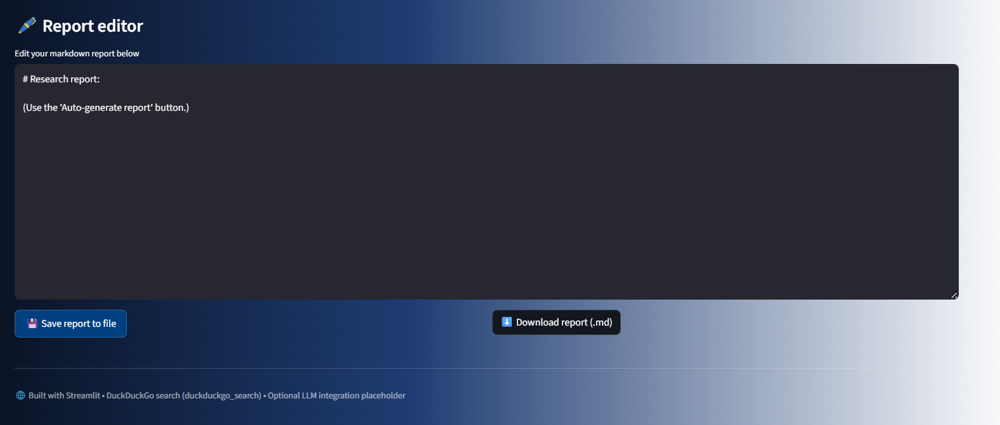

#  Research AI Agent – ReportGenie

An AI-powered research assistant that searches the web, summarizes content,
auto-generates structured reports, and allows editing & download — built using Streamlit.

##  Features
-  DuckDuckGo web search
-  Auto markdown report generation
-  Editable report editor
-  Save & download reports
-  Optional LLM integration (Groq / OpenAI ready)

##  Tech Stack
- Python 3.12.4
- Streamlit
- DuckDuckGo Search API
- dotenv

## How to Run
python -m streamlit run main.py

## app demo

++

